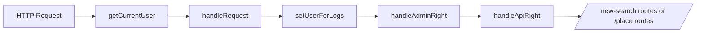
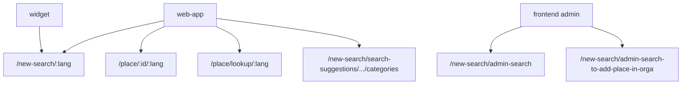

# Search API Rewrite - Current State and Target Direction


This document defines:

1. What exists today in the current Search API ecosystem (`/new-search` + adjacent public read endpoints `/place` used by search journeys).
2. What we want for the rewrite (public-first, versioned, documented, evolvable).
3. A prepared placeholder for conventions and best practices (to be filled in a next step).

Audience: engineers and integrators who do not necessarily know the current Soliguide API internals.

---

## 1) What Exists Today

### 1.1 Runtime Context

The current API is an Express monolith mounted in `packages/api/src/app.ts`.

Relevant route mounts:

- `/new-search` -> `packages/api/src/search/routes/search.routes.ts`
- `/place` -> `packages/api/src/place/routes/place.routes.ts`

Global middleware chain (applied before those routes):

1. `getCurrentUser` (JWT parsing, user loading)
2. `handleRequest` (origin/theme/language/category-service context + origin validation)
3. `setUserForLogs`
4. `handleAdminRight`
5. `handleApiRight`

Important runtime constraints:

- Auth model is JWT user-based (no API key mechanism for search routes at this stage).
- Origin is validated for non-public routes (`/new-search` and `/place` are not in public-route bypass list).
- `API_USER` accounts are globally restricted to route prefixes: `/new-search`, `/place`, `/v2/categories`.



### 1.2 Endpoint Inventory and Behavior

#### Search endpoints (`/new-search`)

| Endpoint | Audience | Access/Guard | Main middleware | Request shape | Response shape | Side effects |
|---|---|---|---|---|---|---|
| `POST /new-search/admin-search` | Backoffice admins | `checkRights([ADMIN_SOLIGUIDE, ADMIN_TERRITORY])` | `searchAdminDto`, `getFilteredData` | Admin search payload (`location`, `country`, `category`, campaign/admin filters, options...) | `{ nbResults, places }` | `logSearchQuery`, `trackSearchPlaces` |
| `POST /new-search/admin-search-to-add-place-in-orga` | Backoffice admins + pro | `checkRights([ADMIN_SOLIGUIDE, ADMIN_TERRITORY, PRO])` | `searchAdminForOrgasDto`, `getFilteredData` | Limited admin payload (`word`, `lieu_id`, `country`, `placeType`, options) | `{ nbResults, places }` | none in route chain |
| `POST /new-search/:lang?` | Public + API clients + backoffice users | No per-route right check; global guards still apply | `handleLanguage`, `locationApiCountryHandling`, `mobilityConverting`, `searchDto`, `getFilteredData` | Public search payload (`location`, `category/categories`, `publics`, `modalities`, `word`, `openToday`, `updatedAt`, `options`...) | `{ nbResults, places }` | `overrideLocationWithAreasInfo`, `logSearchQuery`, `trackSearchPlaces` |
| `GET /new-search/search-suggestions/:country/:term` | Mainly first-party UIs | `isNotApiUser` | `searchSuggestionDto("term")`, `getFilteredData` | URL params; cached autocomplete lookup | suggestion array | in-memory cache hit/store |
| `GET /new-search/search-suggestions/:country/:lang/:term/categories` | First-party web app | `isNotApiUser` | `searchSuggestionDto("term")`, `getFilteredData` | URL params; autocomplete filtered to categories | category suggestions only | in-memory cache hit/store |

Notes:

- `POST /new-search/:lang?` uses context switching:
  - `API` for `API_USER`
  - `PLACE_PUBLIC_SEARCH` or `ITINERARY_PUBLIC_SEARCH` otherwise.
- Translation is applied when `:lang` differs from country source language.
- For `API_USER`, legacy mobility categories can be converted in request and converted back in response.

#### Adjacent place-read endpoints used by search journeys (`/place`)

| Endpoint | Audience | Access/Guard | Main middleware | Request shape | Response shape | Side effects |
|---|---|---|---|---|---|---|
| `GET /place/:lieu_id/:lang?` | Public + API + backoffice users | `getPlaceFromUrl`, `canGetPlace` | `handleLanguage` | URL id/slug + optional lang | place object | `logPlace` |
| `POST /place/lookup/:lang?` | First-party app flow (favorites lookup) | Origin restricted to `MOBILE_APP` or `WEBAPP_SOLIGUIDE` | `handleLanguage`, `lookupDto`, `getFilteredData` | `{ ids: number[], placeType }` | `{ nbResults, places }` | none in route chain |

Notes:

- `lookup` deduplicates ids, applies favorites limit, preserves input order in output.
- `lookup` does not run `canGetPlace` policy per place.

### 1.3 Roles and Access Matrix

| Role/Status | `/new-search/:lang?` | Admin search routes | Suggestions | `/place/:id` | `/place/lookup` |
|---|---|---|---|---|---|
| `ADMIN_SOLIGUIDE` | Yes | Yes | Yes | Yes | Yes (if allowed origin) |
| `ADMIN_TERRITORY` | Yes | Yes | Yes | Yes | Yes (if allowed origin) |
| `PRO` | Yes | `admin-search-to-add-place-in-orga` only | Yes | Yes | Yes (if allowed origin) |
| `API_USER` | Yes (with extra restrictions) | No | No (`isNotApiUser`) | Yes (with strict place constraints) | Usually no (origin gate targets mobile/webapp) |
| Non-logged/public | Yes (origin must still be valid) | No | Yes | Yes (subject to place visibility/status policy) | No (origin gate) |
| `WIDGET_USER`/`SOLI_BOT` | Special behavior in filters (e.g. categories) | N/A | N/A | Depends on route context | N/A |

Key behavior differences:

- `API_USER` search/detail is constrained by allowed territories and category limitations.
- For non-admin/pro users, docs are stripped and visibility/status rules are stricter.
- For regular public search (non-admin context), defaults are enforced (`status=ONLINE`, and `visibility=ALL` for non-PRO).

### 1.4 Field Usage Matrix (Public vs Admin)

#### Public search fields (`POST /new-search/:lang?`)

- Location:
  - `location.geoType`, `location.geoValue`, `location.coordinates`, `location.distance`
  - optional `locations[]` variant for widget flow
- Category filters:
  - `category` (single)
  - `categories` (multiple, restricted to `API_USER`/`WIDGET_USER`/`SOLI_BOT`)
- Other filters:
  - `publics.*`, `modalities.*`, `word`, `openToday`, `updatedAt`, `languages`, `widgetId`
- Control:
  - `placeType`
  - `options.page`, `options.limit`, `options.sortBy`, `options.sortValue`, `options.fields`

#### Admin-only or admin-oriented search fields

These are only available in admin search DTOs or admin query paths:

- `autonomy`
- `campaignStatus`
- `close`
- `organization`
- `priority`
- `sourceMaj`
- `status` (admin semantics)
- `visibility` (admin semantics)
- `country` (required in admin search)
- `catToExclude`
- `lieu_id`
- `updatedByUserAt` (via admin updated date filter path)

#### Legacy/duplicated naming still visible today

- Mixed address/location naming variants can coexist (`address`/`adresse`, `postalCode`/`codePostal`, `department`/`departement`, etc.).
- Logging still carries deprecated nested area structure for compatibility with downstream workflows.
- Mobility taxonomy compatibility layer exists for API users (legacy category conversion).

### 1.5 How It Is Used Today

Current in-repo consumers:

- `packages/widget`:
  - Calls `POST /new-search/:lang`.
- `packages/web-app`:
  - Calls `POST /new-search/:lang` (place + itinerary searches)
  - Calls `GET /place/:identifier/:lang`
  - Calls `POST /place/lookup/:lang`
  - Calls `GET /new-search/search-suggestions/:country/:lang/:term/categories`
- `packages/frontend` (backoffice + historical front):
  - Public search calls `POST /new-search/:lang`
  - Admin tooling calls `/new-search/admin-search` and `/new-search/admin-search-to-add-place-in-orga`



### 1.6 Operational and Technical Notes

- Data access:
  - MongoDB aggregation pipelines over `PlaceModel` (`lieux`), including `$geoNear`, projections, sort/pagination.
  - Separate pipelines for public, API-user, and admin contexts.
- Query composition:
  - Central builder `generateSearchQuery(...)` combines location, categories, publics, modalities, text, open-today, updated-at, plus admin constraints.
- Translation:
  - Search and place detail can be translated when requested language differs from source language.
- Side effects and observability:
  - Search logs persisted (`search` collection).
  - Place view logs persisted (`logFiches` collection).
  - Analytics event `API_SEARCH_PLACES` tracked via PostHog.
  - Location enrichment for logs may call external location API.
- Suggestions:
  - Fuse.js in-memory indexes initialized by country/language.
  - Cache layer on suggestion endpoints.
- Documentation gap:
  - Existing Swagger setup does not provide a complete, reliable contract for this search ecosystem (especially mixed public/admin concerns and route-specific behavior).

---

## 2) What We Want (Target + Migration Path)

### 2.1 Target Outcomes

The rewritten public Search API should:

1. Be contract-first and fully documented with OpenAPI 3 and presented with a UI offering good UX.
2. Be implemented in NestJS with clear modules, DTOs, guards, and readable flows.
3. Run on Fastify for better throughput/latency profile.
4. Support backward-compatible versioning with minimal breaking changes.
5. Separate API contracts from core application services using adapter/translation layers, so core services always speak latest internal model.

### 2.2 Scope Decisions

- Primary scope: public search/read API surface.
- Admin search concerns are removed from the primary surface.
- A dedicated admin search route/module can be added later as a separate concern.

### 2.3 Migration Inventory

#### Must migrate now

- Public search behavior from `POST /new-search/:lang?`:
  - location-based search (including geo/radius)
  - category/publics/modalities/text/open-now/date filters needed by clients
  - place type support (`PLACE`/`ITINERARY`) where still required
- Place read behavior needed in search journeys:
  - `GET /place/:id/:lang?`
  - `POST /place/lookup/:lang?` (if kept in public surface)
- Category suggestions behavior currently used by web-app.
- Required response data currently used by clients.

#### Rename/normalize in new API contract

- Move to English property naming.
- Remove duplicated/deprecated field aliases.

#### Can drop/defer from public contract

- Admin campaign and organization management search semantics.
- Admin-only filters and projections.
- Legacy accidental coupling between logging/backoffice and public payload model.
- Temporary compatibility behavior that is not required by current public consumers.

#### Future extension

- Dedicated admin search API module with its own contract/versioning strategy.
- Authentication evolution to registered client API key model (planned but not blocking initial public rewrite).


### 2.4 Step-by-Step Execution Path


Phase 1 - Contract design:

- Define v1 public endpoints, schemas, error model, and HATEOAS structure.
- Define version negotiation middleware/interceptor behavior.
- Define adapter interfaces (API version <-> core model).

Phase 2 - Implementation:

- Implement NestJS modules/controllers/services.
- Integrate Fastify adapter.
- Generate OpenAPI 3 and serve Scalar UI.

Phase 3 - Adapter and compatibility layer:

- Implement translation from incoming versioned DTOs to latest core service inputs.
- Implement response adapters from core outputs to version-specific public schemas.

Phase 4 - Quality and rollout:

- Add contract tests per endpoint and version.
- Add integration tests for role/access and filter semantics.
- Progressive rollout with monitoring.

Phase 5 - Optional admin extraction:

- Design and implement separate admin search module/route set if needed.

---

## 3) Conventions, Rules, and Best Practices

This section defines the API contract discipline for v1. The goal is to keep the API easy to integrate, safe to evolve, and explicit for both backend and client teams.

### 3.1 Naming and Schemas

#### Use English field names

API keys are always in English. Values and documentation can be translated, but the contract keys remain stable and language-neutral.

#### Use `camelCase` consistently

Use `camelCase` for:
* request body fields
* response body fields
* query parameters

`camelCase` is a style choice; consistency is the real requirement. Mixing naming styles in one API increases integration friction and errors.

#### Prefer arrays over key maps for evolvable structures

When a structure may gain new entries over time, use arrays instead of hardcoded object keys. This keeps the schema extensible without breaking changes.

```json
// ❌ Not evolvable
{
  "contact": {
    "facebook": "https://www.facebook.com/soliguide/",
    "instagram": "https://www.instagram.com/soliguide/"
  }
}
```

```json
// ✅ Evolvable
{
  "contact": {
    "socialNetworks": [
      { "name": "facebook", "url": "https://www.facebook.com/soliguide/" },
      { "name": "instagram", "url": "https://www.instagram.com/soliguide/" }
    ]
  }
}
```

#### Use standards whenever applicable

When a relevant standard exists, adopt it explicitly and document it in OpenAPI.

Example:
* ISO 8601 date/time: <https://en.wikipedia.org/wiki/ISO_8601>
* ISO 3166-1 alpha-2 country code: <https://en.wikipedia.org/wiki/ISO_3166-1>
* ISO 639-3 language code: <https://en.wikipedia.org/wiki/ISO_639-3>

#### Use enums for closed value sets, and document each value meaning

If a field has a finite, well-defined list of values, model it as an enum instead of a free string.  
Each enum value must include a semantic description in the docs.

Example (`type`):

```json
{
  "type": "place"
}
```

Allowed values:
* `place`: a fixed-location service with one main address/location.
* `itinerary`: a mobile or route-based service with moving points or scheduled stops.

#### Use one canonical field name per business concept

For each business concept, expose one canonical field name in the public API contract.  
Avoid exposing multiple field names for the same meaning.

Why:
* reduces ambiguity for clients
* avoids inconsistent payloads
* simplifies long-term compatibility

Examples:

```json
// ❌ Ambiguous contract (aliases for same concept)
{
  "postalCode": "75003",
  "codePostal": "75003"
}

// ✅ Canonical contract
{
  "postalCode": "75003"
}
```

```json
// ❌ Ambiguous contract (two fields for one category concept)
{
  "category": "health",
  "categories": ["health"]
}

// ✅ Canonical contract (single field)
{
  "categories": ["health"]
}
```


### 3.2 Versioning

#### Use date-based versions

Use the `YYYY-MM-DD` format for all public API versions.

Date-based versions are explicit and easier to track than a plain numeric version.


#### Support header-first version negotiation

Clients can pass the version in:
* Header: `X-Soliguide-Api-Version`
* Query string: `api-version`

If both are present, the header value wins.

Header-first negotiation keeps URLs stable while still allowing a fallback when headers are harder to set.

Examples:

```http
// ✅ Header and query both present: header wins
GET /v1/search/places?api-version=2026-03-01
X-Soliguide-Api-Version: 2026-06-01
```

Effective version: `2026-06-01`.


#### Keep changes additive inside one version

Within one published version date, contract changes are additive only.

Forbidden in the same version:
* field rename
* field removal
* type change
* semantic behavior change without a new version date

Why:
* prevents silent breakages for integrators
* allows internal evolution without breaking published contracts

Examples:

```json
// Baseline contract
// -> 2026-03-02
{
  "id": 123,
  "displayName": "Example Place",
  "timeZone": "UTC+1"
}

// ❌ Breaking change in same version (field rename)
// -> 2026-03-02
{
  "id": 123,
  "name": "Example Place",
  "timeZone": "UTC+1"
}

// ❌ Breaking change in same version (type change)
// -> 2026-03-02
{
  "id": "123",
  "displayName": "Example Place",
  "timeZone": "UTC+1"
}

// ❌ Breaking change in same version (field removal)
// -> 2026-03-02
{
  "id": 123,
  "displayName": "Example Place"
}

// ✅ Additive change in same version
// -> 2026-03-02
{
  "id": 123,
  "displayName": "Example Place",
  "timeZone": "UTC+1",
  "description": "Lorem Ipsum"
}

// ✅ Allowed in a new version
// -> 2026-03-10
{
  "id": "pl_123",
  "name": "Example Place",
  "timeZone": "Europe/Paris"
}
```

### 3.3 HATEOAS Conventions

#### Include links in all responses

Return a `_links` object in both single-resource and collection responses.

Links make navigation explicit and reduce client guesswork.

Single resource example:

```json
{
  "id": "pl_123",
  "name": "Example Place",
  "timeZone": "Europe/Paris",
  "_links": {
    "self": { "href": "/v1/places/pl_123" },
    "search": { "href": "/v1/search/places?placeType=place" }
  }
}
```

#### Always provide at least `self`

Every response must include a canonical `self` link.

Add `next`, `prev`, and related links only when they are relevant for that response.

Collection example:

```json
{
  "results": [],
  "_links": {
    "self": { "href": "/v1/search/places?page=1&limit=20" },
    "next": { "href": "/v1/search/places?page=2&limit=20" }
  },
  "page": {
    "current": 1,
    "limit": 20,
    "totalResults": 132,
    "totalPages": 7
  }
}
```

#### Document relation semantics in OpenAPI

Each relation (`self`, `next`, `prev`, `search`, and future relations) must have documented meaning in OpenAPI.

This prevents relation names from drifting across endpoints and versions.

#### Use `page` and `limit` for collection navigation

For v1 search endpoints:
* use `page` + `limit`
* default `limit` is `20`
* maximum `limit` is `100`
* document sort and filter behavior explicitly in OpenAPI
* keep ordering deterministic (add stable tie-breakers when needed)

Why:
* `page/limit` matches current clients and reduces migration effort
* max limit protects database and latency under load

Examples:

```http
POST /v1/search/places?page=2&limit=20
```

```json
{
  "results": [],
  "page": {
    "current": 2,
    "limit": 20,
    "totalResults": 132,
    "totalPages": 7
  },
  "_links": {
    "self": { "href": "/v1/search/places?page=2&limit=20" },
    "next": { "href": "/v1/search/places?page=3&limit=20" },
    "prev": { "href": "/v1/search/places?page=1&limit=20" }
  }
}
```

```json
{
  "results": [],
  "_page": {
    "current": 2,
    "limit": 20,
    "totalResults": 132,
    "totalPages": 7
  },
  "_links": {
    "self": { "href": "/v1/search/places?page=2&limit=20" },
    "next": { "href": "/v1/search/places?page=3&limit=20" },
    "prev": { "href": "/v1/search/places?page=1&limit=20" }
  }
}
```


### 3.4 Testing and Quality Gates

#### Run contract tests against OpenAPI

Before release, contract tests must validate response codes and payload schemas against the published OpenAPI contract.

Example:

```text
GET /v1/places/pl_123
Expected:
- 200 response matches Place schema
- 404 response matches Error schema
```

#### Cover critical user journeys with E2E tests

Before release, E2E tests must validate end-to-end behavior through real HTTP endpoints for critical search journeys.

Example:

```text
Journey: search -> open place detail
1. POST /v1/search/places?page=1&limit=20
2. Extract first place id
3. GET /v1/places/{id}
4. Assert fields and links are consistent
```

#### Protect backward compatibility across versions

Before release, compatibility tests must confirm that older API versions still behave as documented after internal changes.

Example:

```text
Version compatibility check:
- Request with X-Soliguide-Api-Version: 2026-03-01 -> old contract shape
- Request with X-Soliguide-Api-Version: 2026-09-01 -> new contract shape
```
