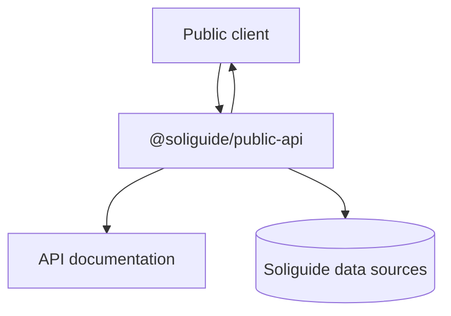
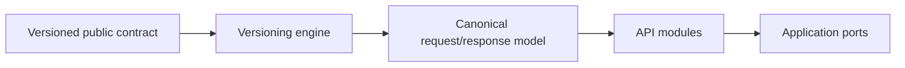
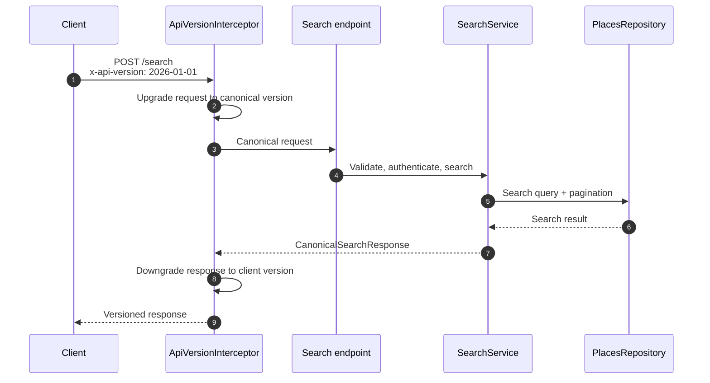
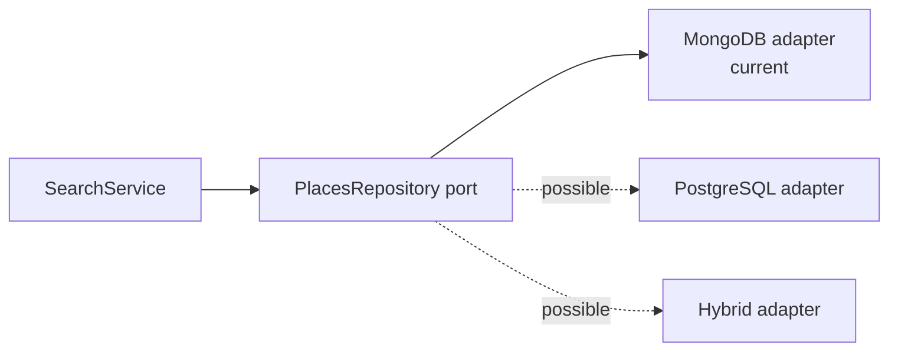
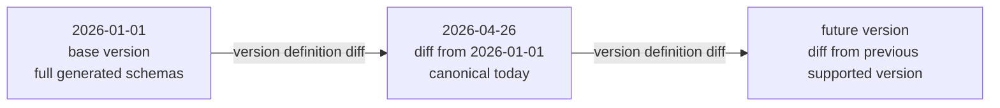
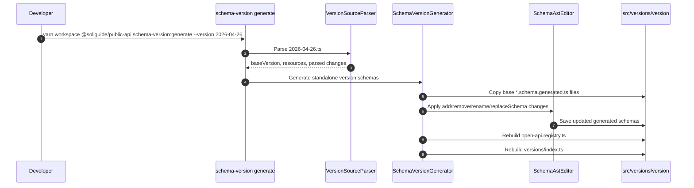
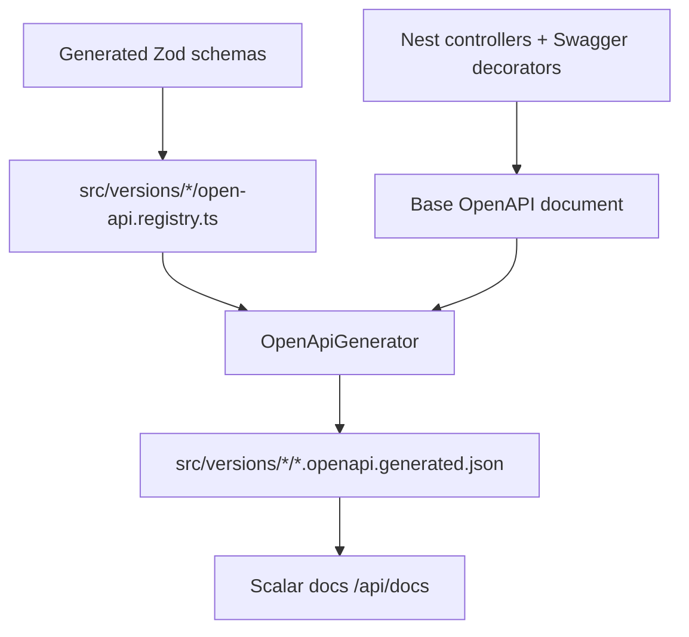
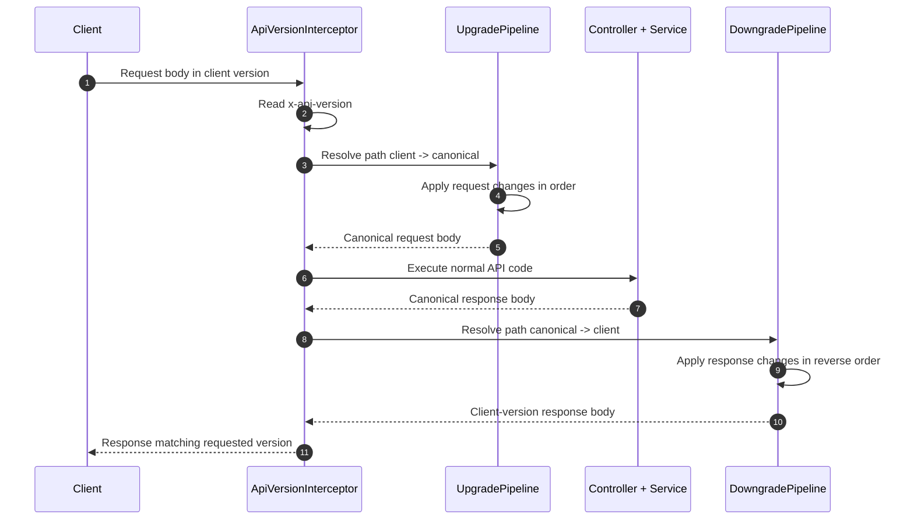

# Soliguide Public API

`@soliguide/public-api` is the new public-facing Soliguide API. It is intended
to progressively replace the public responsibilities of
[`@soliguide/api`](../api/), while the existing API remains available for
administration and internal back-office workflows.

The package has two main responsibilities:

- expose a normalized public API, currently focused on place search;
- maintain a versioned public contract that stays backward compatible while the
  internal canonical model can keep moving forward.

The long-term goal is to decouple public clients from the database and from the
legacy API shape. Clients should consume stable, documented, English API
contracts. The application code should work with a canonical contract. Storage
details should remain behind repository adapters.

## Goals

- Decouple the public contract from the MongoDB document shape.
- Keep API versions backward compatible.
- Generate readable OpenAPI documentation from the same schemas used at
  runtime.
- Normalize public naming and payloads: English names, explicit fields, and
  standard API behavior.
- Avoid duplicating full schemas for every small version change.

## Package Shape

At the highest level, this package is the public boundary between external
clients and Soliguide data. It owns public contracts and delegates data access
behind application ports.



Inside the package, the versioning engine protects the public contract while API
modules implement the canonical behavior.



The important boundary is the port, not the current storage adapter. For
example, search depends on a `PlacesRepository` interface. Today one adapter
uses MongoDB and legacy models, but another adapter could use PostgreSQL, a
search engine, or several data sources together without changing the public API
contract. The public contract is defined by generated version schemas and by the
canonical request/response types used by this package.

## Runtime Entry Points

- [`src/main.ts`](src/main.ts) starts the Nest/Fastify application, connects
  Mongoose, registers OpenAPI documentation, enables Helmet, and listens on
  `PORT` or `3002`.
- [`src/app.module.ts`](src/app.module.ts) wires the `VersioningModule`,
  `SearchModule`, version context providers, and the global
  `ApiVersionInterceptor`.
- [`src/openapi.ts`](src/openapi.ts) serves generated OpenAPI JSON files under
  `/openapi/{version}.json` and exposes the Scalar reference at `/api/docs`.

Required environment variables:

- `MONGODB_URI`
- `JWT_SECRET`

## The API Layer

Everything outside [`src/versioning-engine`](src/versioning-engine/) is the API
itself: Nest modules, controllers, authentication, validation, canonical domain
types, query policies, repositories, and database adapters.

### Why It Exists

The old public behavior lived inside `@soliguide/api`, whose payloads are close
to the database and contain legacy French names, legacy aliases, and internal
fields. The new API layer exists to create a clean boundary:

- controllers expose public operations;
- Zod schemas validate canonical request bodies;
- services operate on canonical request/response types;
- query factories and policies convert public intent into internal search
  constraints;
- repositories hide the persistence mechanism.

This lets the public API evolve independently from MongoDB, Mongoose models, and
the administration API.

### Current Search Flow

The current public operation is `POST /search`, implemented by
[`SearchController`](src/search/search.controller.ts).



The search module itself stays centered on the repository port. The current
MongoDB adapter is only one implementation of that port.



Key files:

- [`src/search/search.controller.ts`](src/search/search.controller.ts):
  operation definition, authentication guard, canonical validation, and
  versioned resource metadata.
- [`src/search/search.service.ts`](src/search/search.service.ts): canonical
  application flow for search.
- [`src/search/repositories/places.repository.ts`](src/search/repositories/places.repository.ts):
  persistence port.
- [`src/search/repositories/mongo`](src/search/repositories/mongo/): current
  adapter implementation.

## The Versioning Engine

The versioning engine is located in
[`src/versioning-engine`](src/versioning-engine/). It owns the public contract
across versions.

It has two complementary responsibilities:

- build time: generate standalone schemas and OpenAPI files for each public
  version;
- runtime: transform requests from the client version to the canonical version,
  then transform responses from the canonical version back to the client
  version.

### Why It Exists

The public API needs strong backward compatibility, but duplicating every full
schema for every new API version would be expensive and error-prone. Most
versions are small changes: a rename, a removed legacy field, a new field, or a
small shape replacement.

The versioning engine uses a diff-based system:

- [`2026-01-01`](src/versions/2026-01-01/) is the base version matching the
  existing `@soliguide/api` public behavior.
- New versions, such as
  [`2026-04-26`](src/versions/2026-04-26/), define only the differences from
  their base version.
- A small DSL describes those differences once.
- The same diffs drive schema generation, OpenAPI generation, runtime request
  upgrades, and runtime response downgrades.

This keeps schema, documentation, validation, and transformations aligned from a
single source of truth.

### Version Graph

Versions are date tokens in `YYYY-MM-DD` format. A version definition declares
its `baseVersion`, so versions form a graph of diff segments.



The canonical version is resolved as the latest supported version known by the
runtime version graph. The current canonical search schemas are imported from
`2026-04-26`.

An old public version can be removed without forcing every newer schema to be
manually rewritten. The important constraint is that the remaining supported
versions must still form a valid path from each supported client version to the
canonical version.

### DSL

Version definitions live in
[`src/versions/{version}/{version}.ts`](src/versions/2026-04-26/2026-04-26.ts).
They use helpers from [`src/versioning-engine/dsl`](src/versioning-engine/dsl/).

```ts
export default defineVersion({
  version: "2026-04-26",
  baseVersion: "2026-01-01",
  resources: [
    resource("search-request", {
      kind: "request",
      changes: searchRequestChanges,
    }),
    resource("search-response", {
      kind: "response",
      contextProvider: V20260426_CONTEXT_PROVIDER,
      changes: searchResponseChanges,
    }),
  ],
});
```

Supported change helpers:

- `add`: add a field to an object schema.
- `remove`: remove a field or nested path.
- `rename`: rename a field at a given path.
- `replaceSchema`: replace a schema at a path with an explicit Zod schema.
- `patch`: group related changes under a shared title, description, impact, or
  payload path.

For example, starting from this base schema:

```ts
export const v1SearchRequestSchema = z.object({
  word: z.string().optional(),
  legacyInternalCode: z.string().optional(),
  address: z.object({
    zipcode: z.string(),
    cityName: z.string(),
  }),
  pagination: z.object({
    page: z.number(),
    limit: z.number(),
  }),
});
```

The next version can describe only the diff:

```ts
import { z } from "zod";

import { schema } from "../../versioning-engine/dsl";

export const exampleChanges = ({ add, remove, rename, replaceSchema, patch }) => [
  rename({
    payloadPath: "",
    from: "word",
    to: "q",
  }),

  add({
    payloadPath: "",
    field: "locale",
    schema: schema(z.string().describe("Preferred locale for localized content.")),
  }),

  remove({
    payloadPath: "legacyInternalCode",
  }),

  replaceSchema({
    payloadPath: "pagination",
    schema: schema(
      z.object({
        page: z.number().int().min(1),
        perPage: z.number().int().min(1).max(100),
      })
    ),
  }),

  patch({
    title: "Normalize address field names",
    payloadPath: "address",
    changes: [
      rename({
        payloadPath: "address",
        from: "zipcode",
        to: "postalCode",
      }),
      rename({
        payloadPath: "address",
        from: "cityName",
        to: "city",
      }),
    ],
  }),
];
```

The generated schema for the new version becomes equivalent to:

```ts
export const v2SearchRequestSchema = z.object({
  q: z.string().optional(),
  locale: z.string().describe("Preferred locale for localized content."),
  address: z.object({
    postalCode: z.string(),
    city: z.string(),
  }),
  pagination: z.object({
    page: z.number().int().min(1),
    perPage: z.number().int().min(1).max(100),
  }),
});
```

Each change can include documentation metadata such as `title`, `description`,
and `impact`. Request resources can define `upgrade` transforms. Response
resources can define `downgrade` transforms.

Examples from `2026-04-26`:

- request changes convert legacy single fields to arrays, such as `category` to
  `categories` and `location` to `locations`;
- request changes rename `word` to `q`;
- request and response changes normalize French field names to English names;
- response changes remove hidden/internal fields from the public output;
- response changes use `replaceSchema` for larger shape updates, such as
  discriminating place result shape by `placeType`.

### Build-Time Schema Generation

Schema generation is implemented by
[`SchemaVersionGenerator`](src/versioning-engine/schema-versioning/schema-version.generator.ts).

It reads a version definition, copies the base version generated schemas, applies
the DSL diffs with a TypeScript AST editor, updates version tokens, prunes unused
declarations, and rebuilds the OpenAPI registry.



The generated schemas are committed. They are used for:

- canonical TypeScript types;
- runtime Zod validation;
- OpenAPI schema generation;
- version-specific documentation.

### Build-Time OpenAPI Generation

OpenAPI generation is implemented by
[`OpenApiGenerator`](src/versioning-engine/open-api/open-api.generator.ts).

It starts from the Nest Swagger document, then replaces operation request and
response schemas with the version-specific Zod schemas registered in
`open-api.registry.ts`.



Each operation must have a stable `operationId`. The generator checks that every
operation has a matching registry entry and that every registry entry references
an existing operation.

### Runtime Version Transformation

Runtime versioning is wired globally by
[`ApiVersionInterceptor`](src/api-version.interceptor.ts).

Controllers opt in with `@VersionedResources`:

```ts
@VersionedResources({
  request: "search-request",
  response: "search-response",
})
```

The client selects a version with the `x-api-version` header. If the header is
missing, the canonical version is used.



The runtime pipeline is intentionally resource-based. If a version segment does
not define changes for the requested resource and direction, that segment is
skipped.

Default runtime behavior:

- `rename` renames fields in both directions;
- `remove` removes a field on upgrade;
- `add` removes the field on downgrade;
- `patch` applies its child changes;
- `replaceSchema` affects generated schemas and requires a custom runtime
  transform when data shape conversion is needed.

Custom runtime helpers live in
[`src/versioning-engine/runtime-pipeline/transformers.ts`](src/versioning-engine/runtime-pipeline/transformers.ts),
for example `renameAt`, `renameNestedAt`, `deleteAt`, `restore`, and
`fromSingleToArray`.

### Runtime Context Providers

Some downgrades need information that was intentionally removed from the
canonical response. For example, `2026-04-26` removes legacy fields but still
needs to restore them when a `2026-01-01` client asks for the response.

Those cases use a version context provider. The current example is specific to
the `2026-04-26` version:

- [`runtime/context.ts`](src/versions/2026-04-26/runtime/context.ts) defines the
  `2026-04-26` context contract and provider token.
- [`runtime/mongo-context.adapter.ts`](src/versions/2026-04-26/runtime/mongo-context.adapter.ts)
  is the `2026-04-26` MongoDB-backed provider. It loads the legacy snapshots
  needed to downgrade `2026-04-26` canonical responses back to the `2026-01-01`
  response shape.
- [`app.module.ts`](src/app.module.ts) registers the provider.

This keeps normal API code canonical while allowing compatibility transforms to
retrieve only the extra legacy data they need.

Context providers are part of the compatibility contract. As long as a public
version needs a context provider, the data required by that provider must remain
retrievable. For example, if `2026-01-01` is still supported and the downgrade
from `2026-04-26` needs fields from `V20260426To20260101PlaceRestoreSnapshot`,
then those fields must still be available somewhere. If the MongoDB structure
changes, or if fields are removed from the live collection, developers must
update the context provider and keep another reliable source for that legacy
data before the database change is deployed. Otherwise, the API may still accept
the old version header but be unable to rebuild the old response shape.

## Adding A New Version

1. Create `src/versions/{new-version}/{new-version}.ts`.
2. Define `version`, `baseVersion`, and the resource diffs with `defineVersion`
   and `resource`.
3. Add change files under `src/versions/{new-version}/changes/`.
4. Add runtime context providers only when a downgrade cannot be derived from
   the canonical payload alone. If a context provider is required, make sure its
   source data will remain available for as long as every version depending on
   it is supported.
5. Register the version definition in
   [`src/versions/version-definitions.ts`](src/versions/version-definitions.ts).
6. Generate version artifacts:

   ```bash
   yarn workspace @soliguide/public-api version-artifacts:generate --version 2026-04-26
   ```

7. Update canonical imports if the new version becomes canonical, for example
   in `canonical-search-request.ts` and `canonical-search-response.ts`.
8. Add version tests, especially for request upgrade and response downgrade
   behavior.

## Development Commands

From the repository root:

```bash
yarn workspace @soliguide/public-api watch
yarn workspace @soliguide/public-api test
yarn workspace @soliguide/public-api test:e2e
yarn workspace @soliguide/public-api lint
yarn workspace @soliguide/public-api format
```

Generate version artifacts:

```bash
yarn workspace @soliguide/public-api version-artifacts:generate --version 2026-04-26
```

Run the two generators separately only when you need to debug one step:

```bash
yarn workspace @soliguide/public-api schema-version:generate --version 2026-04-26
yarn workspace @soliguide/public-api openapi:generate --version 2026-04-26
```

Run the server:

```bash
yarn workspace @soliguide/public-api start
```

The server listens on `PORT` or `3002`. Documentation is available at
`/api/docs`, and generated OpenAPI JSON files are available at
`/openapi/{version}.json`.
